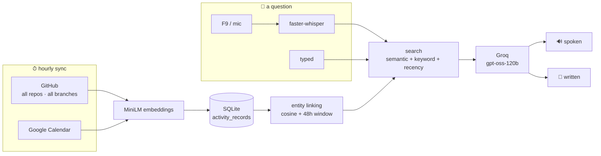

<div align="center">

# 🧠 Second Brain

**Ask your own history out loud — and get an answer worth pasting.**

Hold <kbd>F9</kbd>, ask *"what did I ship on wasm-sentry?"*, and hear the answer
while the written version lands on your clipboard.

<p>
  
  
  
  
</p>

</div>

---

## ✨ What it does

It ingests what you actually did — every commit across your repos, every event on
your calendar — embeds it, and answers questions about it in your own timeline.

|  | |
|---|---|
| 🎙️ **Ask out loud** | Hold <kbd>F9</kbd> anywhere, speak, hear the answer back |
| ⌨️ **Or type it** | A local window when you can't talk — text only, no speech |
| 🔍 **Real recall** | *"What was my latest commit on dify?"* → the right one, from the right branch |
| 📋 **Two answers, one call** | A short spoken one, and a written one with dates and bullets for a doc or an email |
| 🌱 **Branch-aware** | Work sitting on a PR branch shows as `dify [fix/logstore…]`, so unlanded work is visible |
| 🔒 **Local by default** | The database, the embeddings and the speech never leave the machine |

## 🏗️ How it works



Ranking blends three signals, because any one of them alone gets something wrong:

```
0.70 × semantic   +   0.15 × keyword   +   0.15 × recency
```

Recency matters more than it looks: without it nothing in the system knows what
*"latest"* means, and a question about your newest commit gets answered from a
months-old one that happened to embed slightly closer.

<details>
<summary><b>📦 Setup</b></summary>

<br>

**1. Install**

```bash
python3 -m venv .venv
.venv/bin/pip install -r requirements.txt
```

**2. Credentials** — create `.env` in the repo root:

```env
GITHUB_TOKEN=ghp_...        # repo scope, to read your commits
GROQ_API_KEY=gsk_...        # console.groq.com
```

**3. Google Calendar** — download an OAuth **desktop app** client from the Google
Cloud Console as `credentials.json`. Then, in that console, set the consent
screen's publishing status to **In production**.

> ⚠️ While it's in *Testing*, Google expires the refresh token every 7 days and
> you'll be re-authorising constantly. Publishing is the fix; the "unverified
> app" warning at consent is cosmetic.

**4. First run** — a browser opens once for Google consent:

```bash
python -m src.ingest_all          # incremental
python -m src.ingest_all --full   # re-fetch and re-embed everything
```

</details>

<details>
<summary><b>🚀 Running it without a terminal</b></summary>

<br>

A launch agent runs the menubar app, so the repo never has to be open in a
terminal. By default you start it yourself:

```bash
scripts/launch_agent.sh install     # set it up, don't start anything yet
scripts/launch_agent.sh start       # start it now
scripts/launch_agent.sh stop        # stop it, and it stays stopped
```

Add `--login` if you'd rather have it always there — it then starts at every
login and restarts itself if it crashes, while still respecting **Quit** from the
menu (a clean exit stays exited until the next login):

```bash
scripts/launch_agent.sh install --login
```

```bash
scripts/launch_agent.sh status      # installed? running? last exit code?
scripts/launch_agent.sh logs        # stdout/stderr from the agent
scripts/launch_agent.sh perms       # what to grant for the F9 hotkey
scripts/launch_agent.sh uninstall   # remove it entirely
```

> ⚠️ Run from a terminal, the <kbd>F9</kbd> hotkey rode on the terminal's
> Accessibility permission. Run by launchd, the Python interpreter needs its own
> grant — `perms` prints the exact path. Until then, recording still works from
> the menu.

</details>

<details>
<summary><b>🖥️ The two interfaces</b></summary>

<br>

**Menubar** — the launcher and the quick controls. The latest answer is rendered
into the dropdown itself, so reading it doesn't take a click:

```
Open Window
Start Recording
● Speaking — click to stop
──────────────────────────────
heard: what did I ship on wasm-sentry?
- 21 Aug 2026 — Add a dashboard so the extension…
- 21 Aug 2026 — Notify on high-risk pages…
Copy for Docs
──────────────────────────────
Recent ▸    Show Transcript…
Sync Now (last: 4m ago)
```

**Window** — `http://127.0.0.1:8765`, served by the app itself over the standard
library. Type a question with <kbd>⌘</kbd><kbd>↵</kbd>, watch live state, replay
an earlier answer. A typed question is never read aloud — you typed because you
couldn't talk.

</details>

<details>
<summary><b>🔋 What it costs to leave running</b></summary>

<br>

Measured while idle:

| | |
|---|---|
| CPU | **~0.07%**, and **zero** idle wake-ups |
| Memory | **~0.5–0.7 GB** resident (before the speech model loads) |
| Network | 24 syncs a day |

The per-second menu refresh isn't what to worry about. Memory is — the
speech-to-text model alone is ~540 MB, which is why it loads on your first
question rather than at startup, and why syncing is hourly.

</details>

<details>
<summary><b>🗂️ Layout</b></summary>

<br>

```
src/
├── ingestion/    github.py · calendar.py      what happened
├── embeddings/   provider.py                  MiniLM, shared instance
├── storage/      db.py · types.py             SQLite + the record shape
├── entities/     linking.py                   commits → coherent clusters
├── retrieval/    search.py                    semantic + keyword + recency
├── synthesis/    answer.py                    one call, two answers
├── capture/      recorder · transcriber · menubar_app
├── output/       speaker.py · speech.py       macOS say, spoken-form rewriting
├── ui/           server.py · index.html       the local window
├── sync.py       incremental, per-source cursors
└── pipeline.py   question → answer
```

</details>

## 🧭 Design notes

- **Two answers, not one.** What sounds right read aloud and what reads well
  pasted into a doc are different text, so the model returns both in a single
  call rather than costing a second round trip.
- **Speech gets its own pass.** `2026-08-22` read aloud is a 20-million-something
  number and 👋 is announced by name, so the spoken copy is rewritten first —
  markdown stripped, dates spelled out.
- **Sync overlaps by a week.** GitHub filters commits by *commit* date, not push
  date, so work committed locally and pushed days later would otherwise land
  behind the cursor and never be seen.
- **Branches are walked default-first.** Deduped by SHA, so anything still tagged
  with a topic branch is work that hasn't landed.

## ⚠️ Known limits

- Retrieval caps at 25 records, so a question spanning more occurrences than that
  returns a complete-looking but partial list.
- `[branch]` marks unlanded work in the text, but nothing tells the model what
  the convention means — it won't reliably answer *"what hasn't merged?"*
- The local window has no authentication. Fine for one laptop; worth knowing.
- macOS only: the menubar app, the `say` speech backend and the launch agent are
  all platform-specific.
