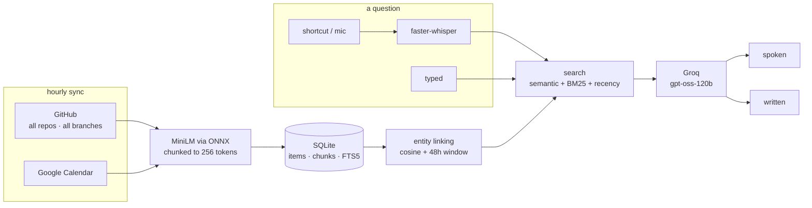

<div align="center">

# Second Brain

**A local question-answering layer over your own activity — commits, pull requests and calendar events — with voice input and spoken answers.**

<p>
  
  
  
  
</p>

</div>

---

## What it does

Second Brain ingests your GitHub commits (across repos and branches), the pull
requests you've opened anywhere, and your Google Calendar events, embeds them
locally, and answers natural-language questions about them. Press a shortcut and ask, or type into a local window.
It runs as a small background service on macOS, Windows and Linux. Each answer comes back in two forms: a short one spoken aloud, and a written one
copied to the clipboard.

| Feature | Description |
|---|---|
| Voice input | Press your shortcut anywhere and ask; recording stops when you go quiet, and the answer is spoken back |
| Typed input | A local window for when speech isn't practical — text only, no speech output |
| Follow-ups | *"how many of those merged?"* carries on from your last question, until you move on or ten minutes pass |
| Retrieval | *"What was my latest commit on `<repo>`?"* resolves to the right commit, from the right branch |
| Dual output | A concise spoken answer plus a written one with dates and bullets |
| Branch awareness | Work on a topic branch is shown as `<repo> [fix/logstore…]`, so unmerged work is distinguishable |
| Pull requests | Every PR you opened, with its state, and your own repos kept apart from other people's projects |
| Local by default | The database, the embeddings and the speech-to-text all run on the machine |

## How it works



Ranking blends three signals, since none of them is sufficient alone:

```
0.70 × semantic   +   0.15 × keyword   +   0.15 × recency
```

- **Semantic** is the cosine between the question and the item's best-matching
  chunk. Long text is split into overlapping windows of the model's own tokens,
  so nothing past its 256-token limit is ignored.
- **Keyword** is BM25 from SQLite's FTS5 index (stemmed, titles weighted double,
  searching field values like attendees and locations too), scaled so each
  question's best match scores 1.

The recency term matters more than its weight suggests: without it, nothing in
the system encodes what *"latest"* means, and a question about the newest commit
can be answered from a months-old one that embeds slightly closer.

## Setup

**1. Install** with [uv](https://docs.astral.sh/uv/). The extras are optional:
`voice` for asking by microphone, `menubar` for the macOS menubar app.

```bash
uv sync --extra voice --extra menubar     # macOS
uv sync --extra voice                     # Windows, Linux
```

**2. Credentials** are stored in the OS keychain (Keychain on macOS, Credential
Manager on Windows, Secret Service on Linux), and each one is only needed by the
source that uses it:

```bash
uv run python -m src.config.env set GROQ_API_KEY    # console.groq.com, needed to answer
uv run python -m src.config.env set GITHUB_TOKEN    # repo scope, only if you want commits and PRs
uv run python -m src.config.env status              # what is set, and where it came from
```

A `.env` file (in the app folder or the repo root) still works as a fallback, and
`python -m src.config.env import-env` copies one into the keychain.

**3. Google Calendar** (optional) — download an OAuth **desktop app** client from
the Google Cloud Console and save it as `credentials.json` in the app folder. In
the same console, set the consent screen's publishing status to **In production**.

> While the app is in *Testing*, Google expires the refresh token every 7 days,
> which means re-authorising constantly. Publishing avoids this; the "unverified
> app" warning shown at consent is cosmetic.

**4. First run** — a browser opens once for Google consent:

```bash
uv run python -m src.ingest_all          # incremental
uv run python -m src.ingest_all --full   # re-fetch and re-embed everything
```

A source that isn't set up is skipped, not treated as an error.

### Where things live

| | |
|---|---|
| macOS | `~/Library/Application Support/SecondBrain` |
| Windows | `%LOCALAPPDATA%\SecondBrain` |
| Linux | `~/.local/share/SecondBrain` |

The database, the Google token and `credentials.json` live there.
`SECOND_BRAIN_HOME` overrides the location. Older checkouts kept these files in the
repo root; on first run they are copied over (never moved, never overwriting), so
delete the originals once you're happy.

### Speech output

`say` on macOS, SAPI (through PowerShell) on Windows, `espeak-ng` on Linux —
install it with your package manager, or answers stay text-only.

### Checks

```bash
uv run python -m unittest discover tests            # offline, no credentials needed
uv run python -m src.eval.retrieval --compare <run> # retrieval quality, see below
```

The retrieval check runs a fixed set of questions with known answers through the
app's ranking, without calling the LLM, so any change that could affect retrieval
(the embedding model, chunking, scoring weights) can be compared against an earlier
run. The questions and a frozen copy of the database stay in `<app folder>/eval`,
since they describe your own activity; see `src/eval/retrieval.py` for the format.

## Running it

Everything runs in one background service. The window, the CLI, the keyboard
shortcut and the macOS menubar are all clients of it.

```bash
uv run python -m src service install            # start at login, restart on crash
uv run python -m src service install --menubar  # macOS: plus the menubar app
uv run python -m src service hotkey             # how to bind a key on this OS
```

It uses what each OS provides: a launchd agent on macOS, a systemd user unit on
Linux, and a Task Scheduler logon task on Windows. On Windows that runs in your
own session rather than as a Windows Service, which would have no microphone or
speakers. Stopping it (or **Quit** in the menu) keeps it stopped until the next
login.

```bash
uv run python -m src service status | start | stop | logs | uninstall
uv run python -m src serve                      # or just run it in a terminal
```

### The shortcut

The shortcut is bound in the OS, not in the app, so it needs no Accessibility
permission and works on Wayland too. It runs `src/__main__.py record`, which only
sends a request, so it takes a few tens of milliseconds. Press it and ask; recording
stops once you've been quiet for 1.5 s, or press it again. `service hotkey` prints
the exact command and where to set it: Shortcuts on macOS, PowerToys or
AutoHotkey on Windows, the desktop's keyboard settings on Linux.

### From a terminal

```bash
python -m src ask "what did I ship this week?"   # prints the written answer
python -m src ask --new "..."                    # ...ignoring recent questions
python -m src new                                # forget the conversation so far
python -m src record                             # start / stop listening
python -m src status | sync | stop | open
```

## Interfaces

**Menubar** (macOS) — quick controls, with the latest answer rendered into the
dropdown, so reading it takes no extra click:

```
Open Window
Start Recording
● Speaking — click to stop
──────────────────────────────
heard: what did I ship on the parser?
- 21 Aug 2026 — Add a dashboard so the extension…
- 21 Aug 2026 — Notify on high-risk pages…
Copy for Docs
──────────────────────────────
Recent ▸    Show Transcript…
Sync Now (last: 4m ago)
```

**Window** — `http://127.0.0.1:8765` (`python -m src open`), served by the
service. Type a question with <kbd>⌘</kbd>/<kbd>Ctrl</kbd><kbd>↵</kbd>, replay an
earlier answer, and watch state change as it happens: the service pushes events
rather than the page polling. Typed questions are never read aloud.

Questions and answers are kept in the database, so history survives a restart.

## Layout

```
src/
├── ingestion/    github · github_prs · calendar   what happened
├── embeddings/   provider · chunking          MiniLM through ONNX Runtime; splitting long text
├── storage/      db.py · types.py             items, chunks, the keyword index; migrations
├── entities/     linking.py                   items → clusters, compared only within 48h
├── retrieval/    search.py                    semantic + keyword + recency
├── synthesis/    answer · tools · rewrite     two answers; exact counts; follow-ups
├── core/         service · api · serve · client · conversation · autostart   the background service
├── capture/      recorder · transcriber · menubar_app
├── output/       speaker.py · speech.py       macOS say, spoken-form rewriting
├── ui/           index.html                   the local window
├── config/       paths · env · google_auth    where files live, credentials
├── eval/         retrieval.py                 fixed questions, scored before and after
├── sync.py       incremental, per-source cursors
└── pipeline.py   question → answer
```

## Design notes

- **Two answers, not one.** Text that sounds right read aloud and text that reads
  well pasted into a document are different, so the model returns both in a
  single call rather than paying for a second round trip.
- **Speech gets its own pass.** Read aloud, `2026-08-22` becomes a
  twenty-million-something number and emoji are announced by name, so the spoken
  copy is rewritten first — markdown stripped, dates spelled out.
- **A follow-up is rewritten before it is searched.** "How many of those
  merged?" embeds to nothing and matches no keywords, so retrieval would answer
  it from whatever that sentence happened to rank. It is turned into a question
  that stands alone first ("how many of the pull requests I opened on other
  people's projects have merged?"), and that is what gets searched and counted —
  the model still sees the question you actually asked.
- **The previous turn's records are deliberately not kept in front of the model.**
  Holding them there made it answer "how many" by counting them again, which is
  exactly what the count exists to stop. The rewritten question finds them again
  anyway.
- **Counts are written out, not handed over as JSON.** Given `{"total": 30}` the
  model would answer 29: it treated the number as something to check against the
  items. A sentence saying the count is final is followed.
- **Counting asks the database, not the model.** Retrieval hands the model the
  best-matching records, never the whole store, so counting those gave a total
  that looked complete and wasn't. A question that turns on a number now runs a
  real query first (`count_activity`), and the answer states that count.
- **Deciding what to count is a call of its own**, carrying the question but not
  the records. Letting the model call the tool mid-conversation would resend
  every record, and two of those exceed the free tier's 8k tokens a minute on
  their own.
- **Pull requests are searched, not crawled.** One query returns every pull
  request you have opened in any repo, with its state, labels and merge time
  already attached — so unlike commits, they cost no per-repo walk, and the first
  sync reaches years back rather than 90 days.
- **A merged pull request is dated when it landed**, not when it was opened, so
  "latest" and "this week" match what you actually did. GitHub's own state only
  says open or closed, so the merge time is what separates a merged pull request
  from an abandoned one.
- **Your repos and other people's are marked apart.** A pull request on someone
  else's project reads as `huggingface/peft #3759 (open, external)`, so
  "what have I contributed to" and "what did I do on my own projects" are
  different questions.
- **Sync overlaps by a week.** GitHub filters commits by *commit* date rather
  than push date, so work committed locally and pushed days later would
  otherwise land behind the cursor and never be ingested.
- **Branches are walked default-first**, deduped by SHA, so anything still tagged
  with a topic branch is work that hasn't landed. Each sync asks GitHub whether
  those commits have since reached the default branch, and drops the tag once they
  have.
- **One shape for every source.** An item has a kind (`commit`, `event`), a time
  normalised to UTC, and `fields` holding what that kind can be filtered on:
  repo, branch and merged for a commit; attendees and location for an event. A
  new source adds fields, not columns.
- **Deletions are kept, not erased.** A calendar event that no longer comes back
  from its window is marked deleted and drops out of answers; if it reappears,
  it's restored.
- **No torch.** The embedding model runs through ONNX Runtime, reproducing
  sentence-transformers exactly (the vectors match to six decimal places), for
  about 650 MB less install.
- **Every retrieval change is measured.** Swapping the model, the schema, the
  keyword scoring and chunking were each run against the same fixed questions
  before being kept.

## Known limitations

- The written answer lists at most 40 matching records, so a question with more
  matches than that names a sample — the count itself stays exact.
- The service answers only its own page and clients holding the per-launch token
  in `service.json`, which only your user account can read. Anything running as
  you can read that file too.
- The Windows and Linux service setups are covered by tests of the files they
  generate, but have only been run for real on macOS.
- Questions about a date (*"what did I ship on 21 Aug?"*) or about *"latest"*
  rank poorly, because the ranking has no idea of a date range or an order; they
  need real queries rather than similarity. The retrieval check tracks both.
- A branch merged by squash or rebase lands as new commits, so the originals keep
  their branch label.
- Deletions are only noticed within the week each sync re-reads, and only for the
  calendar: GitHub skips repos with no recent pushes, so a missing commit proves
  nothing.
